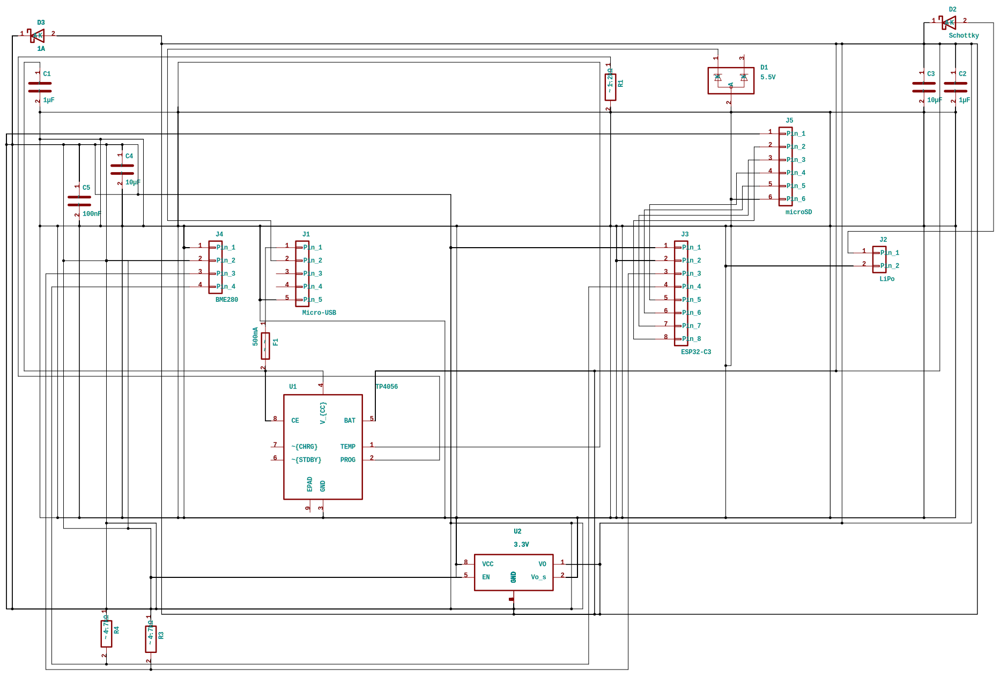
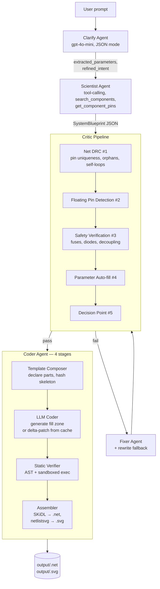

# CNET

A multi-agent LLM pipeline that converts natural-language circuit descriptions into KiCad netlists via SKiDL.

---

>## ⚠️ Beta software — do not trust the output
>
>**This is experimental, hobby-grade software.** The pipeline can and does produce netlists that are wrong: shorted rails, missing decoupling, mis-pinned ICs, hallucinated component values, regulators wired backward, ESD/safety parts in the wrong place, ground loops, and other failures that the Critic stage does not always catch.
>
>**Before you do anything physical with a generated netlist:**
>
>- **Open it in KiCad and review every net by hand.**
>- **Run KiCad's ERC and DRC. Read every warning.**
>- **Sanity-check pinouts against the actual datasheet, not the symbol library.**
>- **Do not power, fabricate, or order a board from a CNET output without manual verification.** You will fry parts. You may damage your bench supply, your USB host, or yourself.
>

---

## 🎯 What it does

You describe a circuit in plain English. CNET runs it through a multi-agent pipeline 
and produces a KiCad netlist you can open, review, and (after manual verification) 
fabricate.


<details>
  <summary>Example</summary>

  ### Prompt
  ```
  Design a 3.3V environmental data logger using an ESP32-C3. It must feature a 
  BME280 sensor (via I2C) and a microSD module (via SPI). For power, include a 
  Micro-USB port with ESD and fuse protection, plus a LiPo battery connection. 
  Use a TP4056 for battery charging and a diode-OR circuit to switch seamlessly 
  between USB and battery power, feeding into a BD33GA5WEFJ 3.3V LDO to power the 
  system. Ensure a common ground.
  ```

  ### Schematic
  

  

  

   ### Blueprint
  <details>
    <summary>Click Here</summary>

     
  ```js
  {
  "design_id": "usb_and_lipo_environmental_data_logger_p_69f6dc85_9208_v2",
  "title": "USB and LiPo Environmental Data Logger Power and Interface Circuit (Critic-corrected)",
  "description": "Environmental data logging circuit powered by USB and LiPo battery, with USB input protection, LiPo charging, diode-OR power path, 3.3V regulation, and connectors for ESP32-C3, BME280, and microSD module. Critic pass applied: TVS diode pinout corrected, LDO enable pin tied to VIN, TP4056 TEMP pin tied directly to GND.",
  "assumptions": [
    "External modules are used for the ESP32-C3, BME280 sensor, and microSD module via connectors rather than placing the ICs directly.",
    "The Micro-USB receptacle is represented by a generic 5-pin connector fallback because no verified library symbol was returned.",
    "The TP4056 charger is represented by a generic 8-pin connector fallback because no verified library symbol was returned. Pin numbering follows the standard SOIC-8 datasheet pinout: 1=TEMP, 2=PROG, 3=GND, 4=VCC, 5=BAT, 6=STDBY, 7=CHRG, 8=CE.",
    "The BD33GA5WEFJ LDO is represented by a generic 5-pin fallback. Pin assignment follows a typical 5-pin LDO convention: 1=VIN, 2=GND, 3=VOUT, 4=EN (tied to VIN), 5=NC/BYP. This must be re-verified against the actual datasheet before fabrication.",
    "The second battery Schottky diode is represented using a generic Schottky diode fallback because a specific verified part with usable pins was not returned.",
    "Unused connector pins are intentionally omitted from nets and documented in reasoning_steps.",
    "The SP0502BAJT (SC-70-3) is mapped with the GND/anode on the middle pin (pin 2), per Littelfuse datasheet, with the two protected I/O cathodes on pins 1 and 3.",
    "No USB data connection to the ESP32-C3 is required; USB D+ and D- are only brought to the TVS and connector for protection."
  ],
  "components": [
    {
      "ref": "J1",
      "category": "connector",
      "exact_part_name": "Conn_01x05",
      "library": "Connector_Generic",
      "mpn": null,
      "custom_symbol_available": false,
      "library_verified": false,
      "substitution_note": null,
      "footprint": "Connector_USB:USB_Micro-B",
      "value": "Micro-USB connector",
      "parameters": {
        "pins": "5",
        "function": "USB power and data input"
      },
      "pins": [
        {"name": "Pin_1", "number": "1", "electrical_type": "passive", "no_connect": false},
        {"name": "Pin_2", "number": "2", "electrical_type": "passive", "no_connect": false},
        {"name": "Pin_3", "number": "3", "electrical_type": "passive", "no_connect": false},
        {"name": "Pin_4", "number": "4", "electrical_type": "passive", "no_connect": true},
        {"name": "Pin_5", "number": "5", "electrical_type": "passive", "no_connect": false}
      ]
    },
    {
      "ref": "D1",
      "category": "tvs_diode",
      "exact_part_name": "SP0502BAJT",
      "library": "Power_Protection",
      "mpn": null,
      "custom_symbol_available": false,
      "library_verified": true,
      "substitution_note": "Pinout corrected to match SC-70-3 datasheet: GND on middle pin (2), I/O cathodes on pins 1 and 3.",
      "footprint": "Package_TO_SOT_SMD:SC-70-3",
      "value": "5.5V",
      "parameters": {
        "tvs_diode": "SP0502BAJT",
        "standoff_voltage": "5.5V",
        "channels": "2"
      },
      "pins": [
        {"name": "K1", "number": "1", "electrical_type": "passive", "no_connect": false},
        {"name": "A",  "number": "2", "electrical_type": "passive", "no_connect": false},
        {"name": "K2", "number": "3", "electrical_type": "passive", "no_connect": false}
      ]
    },
    {
      "ref": "F1",
      "category": "fuse",
      "exact_part_name": "Fuse",
      "library": "Device",
      "mpn": null,
      "custom_symbol_available": false,
      "library_verified": false,
      "substitution_note": null,
      "footprint": "Fuse:Fuse_1206_3216Metric",
      "value": "500mA",
      "parameters": {
        "fuse_rating": "500mA",
        "type": "USB power line fuse"
      },
      "pins": [
        {"name": "1", "number": "1", "electrical_type": "passive", "no_connect": false},
        {"name": "2", "number": "2", "electrical_type": "passive", "no_connect": false}
      ]
    },
    {
      "ref": "J2",
      "category": "connector",
      "exact_part_name": "Conn_01x02",
      "library": "Connector_Generic",
      "mpn": null,
      "custom_symbol_available": false,
      "library_verified": true,
      "substitution_note": null,
      "footprint": "Connector_JST:JST_PH_B2B-PH-K_1x02_P2.00mm_Vertical",
      "value": "2-pin LiPo connector",
      "parameters": {
        "pins": "2",
        "function": "LiPo battery input"
      },
      "pins": [
        {"name": "Pin_1", "number": "1", "electrical_type": "passive", "no_connect": false},
        {"name": "Pin_2", "number": "2", "electrical_type": "passive", "no_connect": false}
      ]
    },
    {
      "ref": "U1",
      "category": "battery_charger",
      "exact_part_name": "Conn_01x08",
      "library": "Connector_Generic",
      "mpn": "TP4056",
      "custom_symbol_available": false,
      "library_verified": false,
      "substitution_note": "Generic 8-pin fallback. Pin order: 1=TEMP, 2=PROG, 3=GND, 4=VCC, 5=BAT, 6=STDBY, 7=CHRG, 8=CE.",
      "footprint": "Package_SO:SOIC-8_3.9x4.9mm_P1.27mm",
      "value": "TP4056 charger",
      "parameters": {
        "charger_ic": "TP4056",
        "pins": "8",
        "charge_resistor": "1.2kΩ (sets ~1A charge current)",
        "temp_pin_handling": "Pin 1 (TEMP) tied directly to GND (no NTC used)"
      },
      "pins": [
        {"name": "Pin_1", "number": "1", "electrical_type": "passive", "no_connect": false},
        {"name": "Pin_2", "number": "2", "electrical_type": "passive", "no_connect": false},
        {"name": "Pin_3", "number": "3", "electrical_type": "passive", "no_connect": false},
        {"name": "Pin_4", "number": "4", "electrical_type": "passive", "no_connect": false},
        {"name": "Pin_5", "number": "5", "electrical_type": "passive", "no_connect": false},
        {"name": "Pin_6", "number": "6", "electrical_type": "passive", "no_connect": true},
        {"name": "Pin_7", "number": "7", "electrical_type": "passive", "no_connect": true},
        {"name": "Pin_8", "number": "8", "electrical_type": "passive", "no_connect": false}
      ]
    },
    {
      "ref": "R1",
      "category": "resistor",
      "exact_part_name": "R",
      "library": "Device",
      "mpn": null,
      "custom_symbol_available": false,
      "library_verified": true,
      "substitution_note": null,
      "footprint": "Resistor_SMD:R_0603_1608Metric",
      "value": "1.2kΩ",
      "parameters": {
        "resistance": "1.2kΩ",
        "power_rating": "0.1W",
        "tolerance": "1%",
        "function": "TP4056 PROG resistor (Iset = 1200/R = ~1A)"
      },
      "pins": [
        {"name": "1", "number": "1", "electrical_type": "passive", "no_connect": false},
        {"name": "2", "number": "2", "electrical_type": "passive", "no_connect": false}
      ]
    },
    {
      "ref": "C1",
      "category": "capacitor",
      "exact_part_name": "C",
      "library": "Device",
      "mpn": null,
      "custom_symbol_available": false,
      "library_verified": true,
      "substitution_note": null,
      "footprint": "Capacitor_SMD:C_0603_1608Metric",
      "value": "1µF",
      "parameters": {
        "capacitance": "1µF",
        "voltage_rating": "10V",
        "dielectric": "X5R",
        "function": "TP4056 VCC decoupling"
      },
      "pins": [
        {"name": "1", "number": "1", "electrical_type": "passive", "no_connect": false},
        {"name": "2", "number": "2", "electrical_type": "passive", "no_connect": false}
      ]
    },
    {
      "ref": "C2",
      "category": "capacitor",
      "exact_part_name": "C",
      "library": "Device",
      "mpn": null,
      "custom_symbol_available": false,
      "library_verified": true,
      "substitution_note": null,
      "footprint": "Capacitor_SMD:C_0603_1608Metric",
      "value": "1µF",
      "parameters": {
        "capacitance": "1µF",
        "voltage_rating": "10V",
        "dielectric": "X5R",
        "function": "TP4056 BAT decoupling"
      },
      "pins": [
        {"name": "1", "number": "1", "electrical_type": "passive", "no_connect": false},
        {"name": "2", "number": "2", "electrical_type": "passive", "no_connect": false}
      ]
    },
    {
      "ref": "D2",
      "category": "diode",
      "exact_part_name": "D_Schottky",
      "library": "Device",
      "mpn": "SS15",
      "custom_symbol_available": false,
      "library_verified": false,
      "substitution_note": null,
      "footprint": "Diode_SMD:D_SMA",
      "value": "SS15 1A",
      "parameters": {
        "diode_for_USB": "SS15",
        "current_rating": "1A",
        "type": "Schottky",
        "function": "USB diode-OR"
      },
      "pins": [
        {"name": "K", "number": "1", "electrical_type": "passive", "no_connect": false},
        {"name": "A", "number": "2", "electrical_type": "passive", "no_connect": false}
      ]
    },
    {
      "ref": "D3",
      "category": "diode",
      "exact_part_name": "D_Schottky",
      "library": "Device",
      "mpn": null,
      "custom_symbol_available": false,
      "library_verified": true,
      "substitution_note": null,
      "footprint": "Diode_SMD:D_SMA",
      "value": "Schottky",
      "parameters": {
        "diode_for_battery": "Schottky",
        "function": "battery diode-OR"
      },
      "pins": [
        {"name": "K", "number": "1", "electrical_type": "passive", "no_connect": false},
        {"name": "A", "number": "2", "electrical_type": "passive", "no_connect": false}
      ]
    },
    {
      "ref": "U2",
      "category": "regulator",
      "exact_part_name": "Conn_01x05",
      "library": "Connector_Generic",
      "mpn": "BD33GA5WEFJ",
      "custom_symbol_available": false,
      "library_verified": false,
      "substitution_note": "Generic 5-pin fallback. Pin assignment assumed: 1=VIN, 2=GND, 3=VOUT, 4=EN, 5=NC/BYP. EN tied to VIN to keep regulator always-on. RE-VERIFY against BD33GA5WEFJ datasheet before tape-out.",
      "footprint": "Package_SO:HTSOP-J8",
      "value": "BD33GA5WEFJ",
      "parameters": {
        "LDO": "BD33GA5WEFJ",
        "output_voltage": "3.3V",
        "pins": "5",
        "function": "3.3V regulation",
        "enable_handling": "EN tied to VIN (always-on)"
      },
      "pins": [
        {"name": "Pin_1", "number": "1", "electrical_type": "passive", "no_connect": false},
        {"name": "Pin_2", "number": "2", "electrical_type": "passive", "no_connect": false},
        {"name": "Pin_3", "number": "3", "electrical_type": "passive", "no_connect": false},
        {"name": "Pin_4", "number": "4", "electrical_type": "passive", "no_connect": false},
        {"name": "Pin_5", "number": "5", "electrical_type": "passive", "no_connect": true}
      ]
    },
    {
      "ref": "C3",
      "category": "capacitor",
      "exact_part_name": "C",
      "library": "Device",
      "mpn": null,
      "custom_symbol_available": false,
      "library_verified": true,
      "substitution_note": null,
      "footprint": "Capacitor_SMD:C_0603_1608Metric",
      "value": "1µF",
      "parameters": {
        "capacitance": "1µF",
        "voltage_rating": "10V",
        "dielectric": "X5R",
        "function": "LDO input decoupling"
      },
      "pins": [
        {"name": "1", "number": "1", "electrical_type": "passive", "no_connect": false},
        {"name": "2", "number": "2", "electrical_type": "passive", "no_connect": false}
      ]
    },
    {
      "ref": "C4",
      "category": "capacitor",
      "exact_part_name": "C_Polarized",
      "library": "Device",
      "mpn": null,
      "custom_symbol_available": false,
      "library_verified": true,
      "substitution_note": "Polarized (tantalum/polymer) per original BOM; verify BD33GA5WEFJ stability requirements vs. ceramic alternatives.",
      "footprint": "Capacitor_SMD:C_1206_3216Metric",
      "value": "10µF",
      "parameters": {
        "capacitance": "10µF",
        "voltage_rating": "10V",
        "function": "LDO input bulk capacitor"
      },
      "pins": [
        {"name": "1", "number": "1", "electrical_type": "passive", "no_connect": false},
        {"name": "2", "number": "2", "electrical_type": "passive", "no_connect": false}
      ]
    },
    {
      "ref": "C5",
      "category": "capacitor",
      "exact_part_name": "C_Polarized",
      "library": "Device",
      "mpn": null,
      "custom_symbol_available": false,
      "library_verified": true,
      "substitution_note": "Polarized (tantalum/polymer) per original BOM; verify BD33GA5WEFJ stability requirements.",
      "footprint": "Capacitor_SMD:C_1206_3216Metric",
      "value": "10µF",
      "parameters": {
        "capacitance": "10µF",
        "voltage_rating": "10V",
        "function": "LDO output bulk capacitor"
      },
      "pins": [
        {"name": "1", "number": "1", "electrical_type": "passive", "no_connect": false},
        {"name": "2", "number": "2", "electrical_type": "passive", "no_connect": false}
      ]
    },
    {
      "ref": "C6",
      "category": "capacitor",
      "exact_part_name": "C",
      "library": "Device",
      "mpn": null,
      "custom_symbol_available": false,
      "library_verified": true,
      "substitution_note": null,
      "footprint": "Capacitor_SMD:C_0603_1608Metric",
      "value": "100nF",
      "parameters": {
        "capacitance": "100nF",
        "voltage_rating": "10V",
        "dielectric": "X7R",
        "function": "LDO output HF bypass"
      },
      "pins": [
        {"name": "1", "number": "1", "electrical_type": "passive", "no_connect": false},
        {"name": "2", "number": "2", "electrical_type": "passive", "no_connect": false}
      ]
    },
    {
      "ref": "J3",
      "category": "connector",
      "exact_part_name": "Conn_01x08",
      "library": "Connector_Generic",
      "mpn": null,
      "custom_symbol_available": false,
      "library_verified": true,
      "substitution_note": null,
      "footprint": "Connector_PinHeader_2.54mm:PinHeader_1x08_P2.54mm_Vertical",
      "value": "8-pin ESP32-C3 connector",
      "parameters": {
        "ESP32_C3_connector": "8-pin",
        "function": "ESP32-C3 module interface"
      },
      "pins": [
        {"name": "Pin_1", "number": "1", "electrical_type": "passive", "no_connect": false},
        {"name": "Pin_2", "number": "2", "electrical_type": "passive", "no_connect": false},
        {"name": "Pin_3", "number": "3", "electrical_type": "passive", "no_connect": false},
        {"name": "Pin_4", "number": "4", "electrical_type": "passive", "no_connect": false},
        {"name": "Pin_5", "number": "5", "electrical_type": "passive", "no_connect": false},
        {"name": "Pin_6", "number": "6", "electrical_type": "passive", "no_connect": false},
        {"name": "Pin_7", "number": "7", "electrical_type": "passive", "no_connect": false},
        {"name": "Pin_8", "number": "8", "electrical_type": "passive", "no_connect": false}
      ]
    },
    {
      "ref": "J4",
      "category": "connector",
      "exact_part_name": "Conn_01x04",
      "library": "Connector_Generic",
      "mpn": null,
      "custom_symbol_available": false,
      "library_verified": true,
      "substitution_note": null,
      "footprint": "Connector_PinHeader_2.54mm:PinHeader_1x04_P2.54mm_Vertical",
      "value": "4-pin BME280 sensor connector",
      "parameters": {
        "BME280_sensor": "4-pin",
        "interface": "I2C"
      },
      "pins": [
        {"name": "Pin_1", "number": "1", "electrical_type": "passive", "no_connect": false},
        {"name": "Pin_2", "number": "2", "electrical_type": "passive", "no_connect": false},
        {"name": "Pin_3", "number": "3", "electrical_type": "passive", "no_connect": false},
        {"name": "Pin_4", "number": "4", "electrical_type": "passive", "no_connect": false}
      ]
    },
    {
      "ref": "J5",
      "category": "connector",
      "exact_part_name": "Conn_01x06",
      "library": "Connector_Generic",
      "mpn": null,
      "custom_symbol_available": false,
      "library_verified": true,
      "substitution_note": null,
      "footprint": "Connector_PinHeader_2.54mm:PinHeader_1x06_P2.54mm_Vertical",
      "value": "6-pin microSD module connector",
      "parameters": {
        "microSD_module": "6-pin",
        "interface": "SPI"
      },
      "pins": [
        {"name": "Pin_1", "number": "1", "electrical_type": "passive", "no_connect": false},
        {"name": "Pin_2", "number": "2", "electrical_type": "passive", "no_connect": false},
        {"name": "Pin_3", "number": "3", "electrical_type": "passive", "no_connect": false},
        {"name": "Pin_4", "number": "4", "electrical_type": "passive", "no_connect": false},
        {"name": "Pin_5", "number": "5", "electrical_type": "passive", "no_connect": false},
        {"name": "Pin_6", "number": "6", "electrical_type": "passive", "no_connect": false}
      ]
    },
    {
      "ref": "R3",
      "category": "resistor",
      "exact_part_name": "R",
      "library": "Device",
      "mpn": null,
      "custom_symbol_available": false,
      "library_verified": true,
      "substitution_note": null,
      "footprint": "Resistor_SMD:R_0603_1608Metric",
      "value": "4.7kΩ",
      "parameters": {
        "resistance": "4.7kΩ",
        "power_rating": "0.1W",
        "tolerance": "1%",
        "function": "I2C SDA pull-up to 3V3"
      },
      "pins": [
        {"name": "1", "number": "1", "electrical_type": "passive", "no_connect": false},
        {"name": "2", "number": "2", "electrical_type": "passive", "no_connect": false}
      ]
    },
    {
      "ref": "R4",
      "category": "resistor",
      "exact_part_name": "R",
      "library": "Device",
      "mpn": null,
      "custom_symbol_available": false,
      "library_verified": true,
      "substitution_note": null,
      "footprint": "Resistor_SMD:R_0603_1608Metric",
      "value": "4.7kΩ",
      "parameters": {
        "resistance": "4.7kΩ",
        "power_rating": "0.1W",
        "tolerance": "1%",
        "function": "I2C SCL pull-up to 3V3"
      },
      "pins": [
        {"name": "1", "number": "1", "electrical_type": "passive", "no_connect": false},
        {"name": "2", "number": "2", "electrical_type": "passive", "no_connect": false}
      ]
    }
  ],
  "nets": [
    {
      "name": "USB_VBUS_RAW",
      "connections": [
        {"component_ref": "J1", "pin_name": "Pin_1"},
        {"component_ref": "F1", "pin_name": "1"}
      ]
    },
    {
      "name": "USB_D-",
      "connections": [
        {"component_ref": "J1", "pin_name": "Pin_2"},
        {"component_ref": "D1", "pin_name": "K1"}
      ]
    },
    {
      "name": "USB_D+",
      "connections": [
        {"component_ref": "J1", "pin_name": "Pin_3"},
        {"component_ref": "D1", "pin_name": "K2"}
      ]
    },
    {
      "name": "GND",
      "connections": [
        {"component_ref": "J1", "pin_name": "Pin_5"},
        {"component_ref": "D1", "pin_name": "A"},
        {"component_ref": "J2", "pin_name": "Pin_2"},
        {"component_ref": "U1", "pin_name": "Pin_1"},
        {"component_ref": "U1", "pin_name": "Pin_3"},
        {"component_ref": "C1", "pin_name": "2"},
        {"component_ref": "C2", "pin_name": "2"},
        {"component_ref": "U2", "pin_name": "Pin_2"},
        {"component_ref": "C3", "pin_name": "2"},
        {"component_ref": "C4", "pin_name": "2"},
        {"component_ref": "C5", "pin_name": "2"},
        {"component_ref": "C6", "pin_name": "2"},
        {"component_ref": "J3", "pin_name": "Pin_2"},
        {"component_ref": "J4", "pin_name": "Pin_2"},
        {"component_ref": "J5", "pin_name": "Pin_6"},
        {"component_ref": "R1", "pin_name": "2"}
      ]
    },
    {
      "name": "USB_5V_FUSED",
      "connections": [
        {"component_ref": "F1", "pin_name": "2"},
        {"component_ref": "U1", "pin_name": "Pin_4"},
        {"component_ref": "U1", "pin_name": "Pin_8"},
        {"component_ref": "C1", "pin_name": "1"},
        {"component_ref": "D2", "pin_name": "A"}
      ]
    },
    {
      "name": "BAT_RAW",
      "connections": [
        {"component_ref": "J2", "pin_name": "Pin_1"},
        {"component_ref": "U1", "pin_name": "Pin_5"},
        {"component_ref": "C2", "pin_name": "1"},
        {"component_ref": "D3", "pin_name": "A"}
      ]
    },
    {
      "name": "PROG_NET",
      "connections": [
        {"component_ref": "U1", "pin_name": "Pin_2"},
        {"component_ref": "R1", "pin_name": "1"}
      ]
    },
    {
      "name": "SYS_POWER_PRE_LDO",
      "connections": [
        {"component_ref": "D2", "pin_name": "K"},
        {"component_ref": "D3", "pin_name": "K"},
        {"component_ref": "U2", "pin_name": "Pin_1"},
        {"component_ref": "U2", "pin_name": "Pin_4"},
        {"component_ref": "C3", "pin_name": "1"},
        {"component_ref": "C4", "pin_name": "1"}
      ]
    },
    {
      "name": "3V3",
      "connections": [
        {"component_ref": "U2", "pin_name": "Pin_3"},
        {"component_ref": "C5", "pin_name": "1"},
        {"component_ref": "C6", "pin_name": "1"},
        {"component_ref": "J3", "pin_name": "Pin_1"},
        {"component_ref": "J4", "pin_name": "Pin_1"},
        {"component_ref": "J5", "pin_name": "Pin_1"},
        {"component_ref": "R3", "pin_name": "1"},
        {"component_ref": "R4", "pin_name": "1"}
      ]
    },
    {
      "name": "I2C_SDA",
      "connections": [
        {"component_ref": "J3", "pin_name": "Pin_3"},
        {"component_ref": "J4", "pin_name": "Pin_3"},
        {"component_ref": "R3", "pin_name": "2"}
      ]
    },
    {
      "name": "I2C_SCL",
      "connections": [
        {"component_ref": "J3", "pin_name": "Pin_4"},
        {"component_ref": "J4", "pin_name": "Pin_4"},
        {"component_ref": "R4", "pin_name": "2"}
      ]
    },
    {
      "name": "SPI_MOSI",
      "connections": [
        {"component_ref": "J3", "pin_name": "Pin_5"},
        {"component_ref": "J5", "pin_name": "Pin_3"}
      ]
    },
    {
      "name": "SPI_MISO",
      "connections": [
        {"component_ref": "J3", "pin_name": "Pin_6"},
        {"component_ref": "J5", "pin_name": "Pin_4"}
      ]
    },
    {
      "name": "SPI_SCK",
      "connections": [
        {"component_ref": "J3", "pin_name": "Pin_7"},
        {"component_ref": "J5", "pin_name": "Pin_2"}
      ]
    },
    {
      "name": "SPI_CS_SD",
      "connections": [
        {"component_ref": "J3", "pin_name": "Pin_8"},
        {"component_ref": "J5", "pin_name": "Pin_5"}
      ]
    }
  ],
  "design_constraints": {
    "input_voltage": "USB 5V and LiPo battery (3.0–4.2V)",
    "output_voltage": "3.3V",
    "max_current": "500mA fuse on USB power line",
    "operating_temp_range": "Not specified",
    "power_source": "USB and LiPo battery (diode-OR'd)",
    "TVS_diode": "SP0502BAJT (D+/D- protection only)",
    "fuse_rating": "500mA",
    "charge_resistor": "1.2kΩ (TP4056 PROG, ~1A charge current)",
    "input_output_decoupling_capacitors": "1µF",
    "diode_for_USB": "SS15",
    "diode_for_battery": "Schottky",
    "LDO": "BD33GA5WEFJ (EN tied to VIN)",
    "LDO_input_capacitors": "1µF and 10µF",
    "LDO_output_capacitors": "10µF and 100nF",
    "ESP32_C3_connector": "8-pin",
    "BME280_sensor": "4-pin",
    "microSD_module": "6-pin",
    "I2C_pull_ups": "4.7kΩ"
  },
  "unresolved_parts": [
    {
      "intended_function": "Micro-USB connector receptacle",
      "searched_queries": ["Micro USB connector receptacle 5 pin"],
      "assigned_name": "Conn_01x05",
      "assigned_library": "Connector_Generic",
      "substitution_note": "Generic 5-pin connector fallback; library_verified=false."
    },
    {
      "intended_function": "500mA fuse",
      "searched_queries": ["500mA fuse"],
      "assigned_name": "Fuse",
      "assigned_library": "Device",
      "substitution_note": "Generic fuse fallback; library_verified=false."
    },
    {
      "intended_function": "TP4056 charger IC",
      "searched_queries": ["TP4056 charger"],
      "assigned_name": "Conn_01x08",
      "assigned_library": "Connector_Generic",
      "substitution_note": "Generic 8-pin connector fallback. Pin order assumed standard SOIC-8 datasheet pinout."
    },
    {
      "intended_function": "SS15 Schottky diode",
      "searched_queries": ["SS15 schottky diode"],
      "assigned_name": "D_Schottky",
      "assigned_library": "Device",
      "substitution_note": "Generic Schottky fallback with mpn=SS15."
    },
    {
      "intended_function": "BD33GA5WEFJ LDO regulator",
      "searched_queries": ["BD33GA5WEFJ 3.3V LDO"],
      "assigned_name": "Conn_01x05",
      "assigned_library": "Connector_Generic",
      "substitution_note": "Generic 5-pin fallback. Pin assignment 1=VIN, 2=GND, 3=VOUT, 4=EN, 5=NC must be re-verified against datasheet."
    }
  ],
  "reasoning_steps": [
    {
      "step_id": "step_1",
      "summary": "Critic fix #1: SP0502BAJT TVS diode pinout corrected.",
      "details": "Original mapping placed K1=Pin1, K2=Pin2, A=Pin3, which is incorrect for the SC-70-3 package — the GND/anode is the middle pin. Corrected mapping is K1=Pin1, A=Pin2, K2=Pin3 per Littelfuse datasheet. Without this fix, the resulting netlist would have routed GND to one of the I/O channels and shorted USB D+ to D- through the internal diode structure on a real chip."
    },
    {
      "step_id": "step_2",
      "summary": "Critic fix #2: BD33GA5WEFJ enable pin tied to VIN.",
      "details": "Original schematic left both Pin_4 and Pin_5 as no_connect. The BD33GA5W family requires the ON/OFF (enable) pin to be tied high for the regulator to produce an output. Pin_4 is now assigned as EN and connected to SYS_POWER_PRE_LDO (always-on configuration). Pin_5 remains NC. Pin assignment is provisional — must be re-verified against the actual datasheet before committing."
    },
    {
      "step_id": "step_3",
      "summary": "Critic fix #3: TP4056 TEMP pin tied directly to GND.",
      "details": "Original design used a 10kΩ resistor (R2) between TP4056 Pin_1 (TEMP) and GND. The TP4056 TEMP pin has an internal current source; resistive coupling to GND can leave it at a voltage that triggers a temperature fault and disables charging. Standard practice when no NTC is fitted is direct GND. R2 has been removed entirely, U1.Pin_1 is now in the GND net, and the TEMP_NET has been deleted."
    },
    {
      "step_id": "step_4",
      "summary": "Power topology verification.",
      "details": "Diode-OR is correct: when USB is present, ~5V – 0.3V (SS15) ≈ 4.7V on SYS_POWER_PRE_LDO; battery side is ~4.2V – 0.3V (D3) ≈ 3.9V, so D3 reverse-biases and USB sources the system. When USB is absent, D2 reverse-biases and the battery sources the system through D3. TP4056 BAT pin (Pin_5) is on BAT_RAW alongside D3's anode, which is correct for charging-while-running."
    },
    {
      "step_id": "step_5",
      "summary": "Module interface mapping unchanged from original.",
      "details": "ESP32-C3 connector (J3) carries 3V3, GND, I2C SDA/SCL, SPI MOSI/MISO/SCK, and SPI CS. BME280 connector (J4) carries 3V3, GND, SDA, SCL with R3/R4 4.7kΩ pull-ups to 3V3. microSD connector (J5) carries 3V3, SCK, MOSI, MISO, CS, GND."
    },
    {
      "step_id": "step_6",
      "summary": "Intentionally unconnected pins.",
      "details": "J1 Pin_4 (USB ID) is NC for non-OTG use. U1 Pin_6 (STDBY) and Pin_7 (CHRG) are NC — no charging-status LEDs in this revision. U2 Pin_5 is NC pending datasheet verification (likely BYP or true NC)."
    },
    {
      "step_id": "step_7",
      "summary": "Open items flagged for follow-up.",
      "details": "1) Verify BD33GA5WEFJ pinout against datasheet — the EN-pin assumption is the most fragile assumption in this design. 2) Verify C4/C5 ESR requirements — polarized 10µF in 1206 may or may not satisfy the LDO loop stability. 3) Consider adding charging-status LEDs on STDBY/CHRG. 4) Consider reverse-polarity protection on J2 (e.g., P-FET ideal diode) to protect TP4056 BAT pin from a backwards-wired battery."
    }
  ],
  "metadata": {
    "total_components": 20,
    "verified_components": 15,
    "unverified_components": 5,
    "components_removed": ["R2 (TP4056 TEMP resistor — not standard)"],
    "critic_fixes_applied": [
      "SP0502BAJT pin mapping corrected (GND on middle pin)",
      "BD33GA5WEFJ EN pin tied to VIN",
      "TP4056 TEMP pin tied directly to GND, R2 removed"
    ],
    "safety_components_included": [
      "SP0502BAJT 5.5V TVS diode on D+/D-",
      "500mA fuse on USB power line",
      "SS15 USB Schottky diode for diode-OR",
      "Battery Schottky diode for diode-OR",
      "TP4056 input/output decoupling",
      "BD33GA5WEFJ input and output bypass capacitors"
    ],
    "schema_version": "1.1"
  }
}
  ```
</details>


</details>
  


   
  


 
---

## 🏗️ Architecture



---


## Installation

Tested on macOS with Python 3.13. Should work on Linux. Untested on Windows.

```bash
# 1. Clone
git clone https://github.com/mehmetkutsalsarsu/Cnet.git
cd Cnet

# 2. Virtual env (required on Homebrew Python — PEP 668)
python3 -m venv .venv
source .venv/bin/activate

# 3. Install
pip install -e ".[dev]"

# 4. Configure secrets
cp .env.example .env
# then edit .env and set OPENAI_API_KEY=sk-...
```


### Required environment variables

| Variable                  | Purpose                                    | Required                  |
|---------------------------|--------------------------------------------|---------------------------|
| `OPENAI_API_KEY`          | All LLM calls (Clarify, Scientist, Fixer, Coder) | Yes                       |


---

## Usage

```bash
source .venv/bin/activate

# One-shot
cnet "5V to 3.3V LDO, USB-C input, 500 mA load, with reverse polarity protection"

# Interactive REPL
cnet

# Verbose logging
cnet -v "555 timer astable, 1 Hz, driving an LED"
```

Outputs land in `output/<design_id>.net` (and `<design_id>.svg` when `netlistsvg` is available).

---


## 🤔 Why not [alternative]?

- **[Atopile](https://atopile.io/).** Atopile is a real, designed-for-humans hardware DSL with type-checked modules and a proper toolchain. If you want to author circuits as code, use Atopile. CNET is an experiment in going the other direction: skip the DSL, let an LLM produce the structure from prose, and validate after the fact.
- **[TSCircuit](https://tscircuit.com/).** TSCircuit is React for circuits — a polished, deliberate developer experience with a real team. CNET is a single-file-pipeline research toy that happens to emit KiCad netlists.

The gap CNET tries to fill: prompt-to-netlist with explicit intermediate JSON you can inspect and edit, separate validation and repair stages instead of a single LLM call, and bring-your-own KiCad libraries. Whether that gap is worth filling is an open question.

---


## 📄 License


- This distribution is licensed under the MIT License. See LICENSE.

---

## 🙏 Credits

This project  wouldn't be possible without the help of these open-source projects:

- **[SKiDL](https://github.com/devbisme/skidl)** — does the heavy lifting of turning a Python description into a KiCad netlist.
- **[KiCad](https://www.kicad.org/)** — symbol libraries and the `.net` format that this whole pipeline targets.
- **[netlistsvg](https://github.com/nturley/netlistsvg)** — optional schematic SVG rendering.
- **[LangChain](https://github.com/langchain-ai/langchain)** — LLM glue: tool-calling loops, structured output, message history.
- **[Pydantic](https://docs.pydantic.dev/)** — `SystemBlueprint` schema and validation.
- **[jsonpatch](https://github.com/stefankoegl/python-json-patch)** — RFC-6902 patch application for the Fixer.
- **[NetworkX](https://networkx.org/)** — graph analysis for some Critic stages.


**Since the only author is a physics student, he may have made mistakes. If you find any errors or have suggestions, please open an issue or pull request.**

